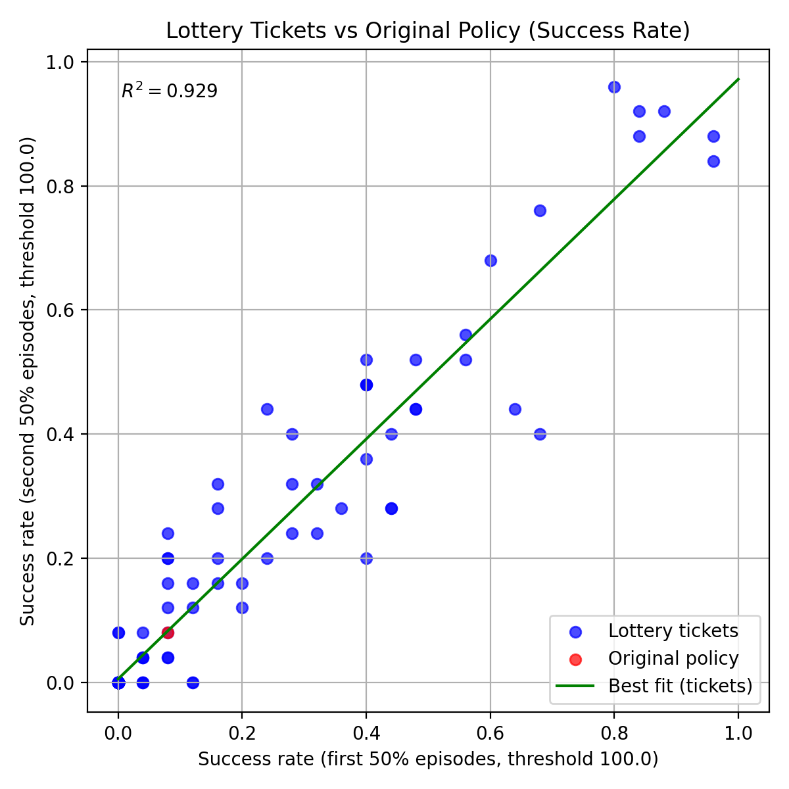
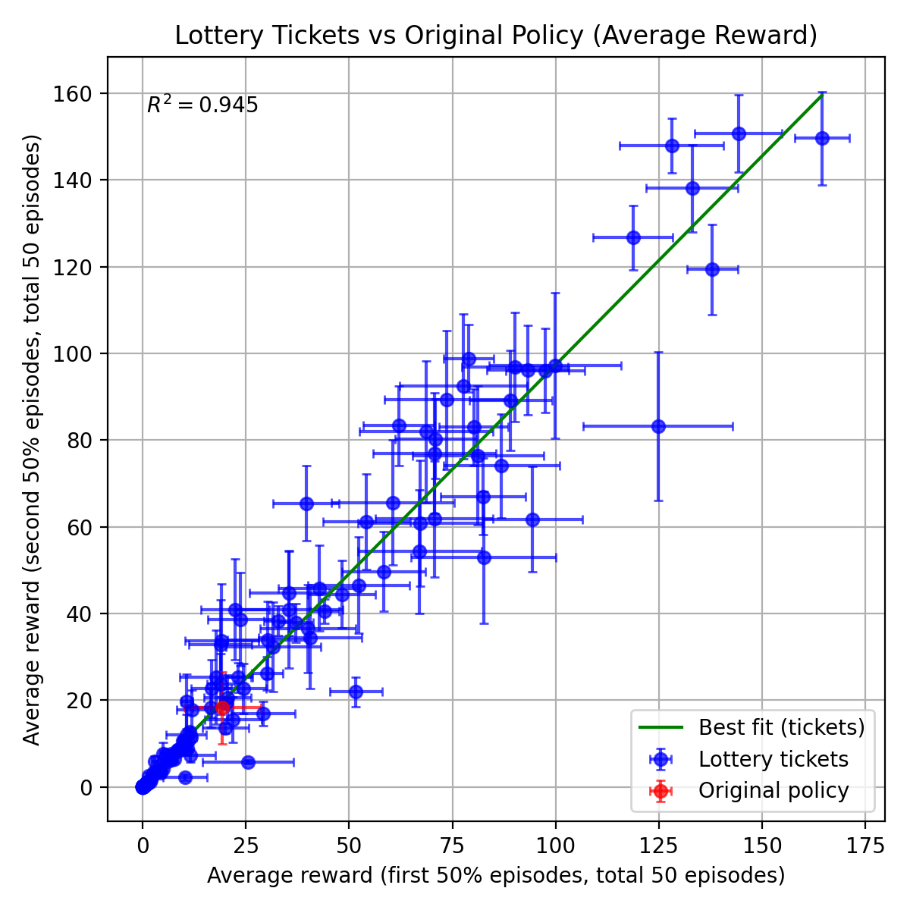

# franka_sim Lottery Ticket Examples

## Setup

Clone the repo **with submodules** and go into it.

```bash
git clone --recursive https://github.com/golden-tickets/golden-ticket-search.git
cd golden-ticket-search
```

From the repo root, create a virtual environment with `uv`, and install the `franka-sim` dependencies:

```bash
uv sync --extra franka-sim
source .venv/bin/activate
```

It helps to set `MUJOCO_GL` to use GPU rendering for faster performance:

```bash
export MUJOCO_GL=egl
```

All experiment scripts run from the `franka_sim_lt` folder, `src/lottery_tickets/franka_sim_lt/`

The codebase supports the following:
1. [Flow matching policies already trained that you can evaluate](#evaluating-pretrained-flow-matching-policy)
2. [Generating a new lottery ticket for franka_sim](#generating-a-new-lottery-ticket-for-franka_sim)
3. [Evaluating an existing franka_sim lottery ticket](#evaluating-an-existing-franka_sim-lottery-ticket)
4. [Visualize ticket and base policy performance](#visualize-ticket-and-base-policy-performance)
5. [Generate data and train your own base policy](#generating-data-and-training-your-own-base-policy)

## Evaluating pretrained flow matching policy
We supply 4 pretrained policy checkpoints located in `src/lottery_tickets/franka_sim_lt/train_model/checkpoints`. Their performance varies, with `fm_seed_1001` being the worst.

You can evaluate that checkpoint by running `evaluate.py` and setting `evaluation.model_path` to your chosen checkpoint.
You can set `num_episodes` to determine how many block poses the policy is evaluated on.
All outputs will be saved in `hydra.run.dir`, which is set to `outputs` by default.
For these examples, we use the checkpoint `fm_seed_1001` and save outputs in `fm_seed_1001_example`.
We'll name this checkpoint the "`original_policy`", to make it easy to compare against tickets later:

```bash
python evaluate.py \
    evaluation.model_path=checkpoints/fm_seed_1001/checkpoints/fm_policy_final.pt \
    +original_policy=True \
    evaluation.num_episodes=10 \
    hydra.run.dir=outputs/fm_seed_1001_example/original_policy
```

You will see the policy's total rewards for each episode get printed out.
This policy typically has an average episode returns of 20-40, whereas a policy that successfully lifts the cube gets >80 episode returns.
`fm_seed_1001` occasionally succeeds, slowly, but is in general not a good policy.

## Generating a new lottery ticket for `franka_sim`

You can generate a new lottery ticket and evaluate it by setting `new_noise=True`.
It will run similarly to the previous script, except that an initial noise will be chosen at the start, used for all episodes, and then saved as `init_x.pt` in the same folder as the rollout videos.
Run the script to draw a lottery ticket and evaluate it:

```bash
python evaluate.py \
    evaluation.model_path=checkpoints/fm_seed_1001/checkpoints/fm_policy_final.pt \
    +new_noise=True \
    evaluation.num_episodes=10 \
    hydra.run.dir=outputs/fm_seed_1001_example/example_ticket
```

Depending on the base policy and the ticket drawn, performance can vary significantly.
If you'd like to generate a large number of tickets, you can run the following bash script.
It will generate `n` tickets and make a folder for each of them inside `output_dir`. 
The example command here generates 25 tickets with 10 environment states (250 episodes), but you can vary this based on your compute budget.
This will create a directory containing a subdirectory for the results of each ticket generated:

```bash
./generate_tickets.sh \
    --n=25 \
    --model_path=checkpoints/fm_seed_1001/checkpoints/fm_policy_final.pt \
    --output_dir=outputs/fm_seed_1001_example \
    --num_episodes=10 \
    --new_noise=true
```

## Evaluating an existing `franka_sim` lottery ticket
You can evaluate the saved `init_x.pt` of a model by passing a path as an argument to the script via the `noise_path` parameter.
We provide golden tickets for three of the pretrained models (`fm_seed_1002`, `fm_seed_1003` and `fm_seed_1004`), located in `src/lottery_tickets/franka_sim_lt/train_model/golden_tickets`.

You can evaluate the golden tickets, for example:

```bash
python evaluate.py \
    evaluation.model_path=checkpoints/fm_seed_1002/checkpoints/fm_policy_final.pt \
    +noise_path=./golden_tickets/fm_seed_1002/init_x.pt \
    evaluation.num_episodes=10 \
    hydra.run.dir=outputs/fm_seed_1002_example/golden_ticket
```

A golden ticket typically averages above 100 episode returns, which is normally a success.
It can still occasionally fail, but it is much more reliable than the base policy.

## Visualize ticket and base policy performance
We can test how well a ticket generalizes to unseen (during ticket selection) states by evaluating a ticket on `num_episodes` different starting states, and then splitting the episode results into two, equally sized groups, and calculating average performance for each group. Tickets that effectively generalize should have similar performance in both groups.

You can visualize performance results in a 2D scatter plot, where the x-axis represents the rewards/success rate for the first 50% of episodes, and the y-axis is the rewards/success rate for the second 50% of episodes.
The more linear this plot is, the more predictably the performance of a golden ticket for this base policy on a set of environment states will generalize to unseen (during ticket selection) states.
To help with checking for this linearity, our graph includes a best-fit line along with r^2 value.
If the results of the base policy are also in the folder (and named `original_policy`), they are added to the plot in a separate color to compare ticket and base policy performance.

The script also prints out the tickets in order of their average episode rewards and task success rate, along with the base policy's at the top:

```bash
python viz_regression_to_mean.py \
    --root_dir=./outputs/fm_seed_1001_example \
    --out_avg=fm_seed_1001_example_rewards.png \
    --out_success=fm_seed_1001_example_success.png \
    --threshold=100
```

Here is an example output from running the script on `fm_seed_1001_example`.
As can be seen by the line of best fit and r^2 value, the performance of the tickets on the first set of episodes is highly predictive of its performance on the other episodes.
Also, we can see that while the base policy (red) has low performance, there are many tickets (blue) that are much better, raising the success rate from ~15% for the base policy to ~90%.

<table align="center">
  <tr>
    <td></td>
    <td></td>
  </tr>
  <tr>
    <td align="center"><em>Success rates for tickets and base policy (`fm_seed_1001`)</em></td>
    <td align="center"><em>Episode rewards for tickets and base policy (`fm_seed_1001`)</em></td>
  </tr>
</table>

## Generating data and training your own base policy
You can generate demonstration data and train your own policy, in case you'd like to experiment with different parts of the pipeline to investigate what causes golden tickets to occur.

First, you can generate expert data by running the following script:

```bash
cd generate_data
python generate_data.py
```

This will use a simple task expert to generate demonstrations of the Franka picking up the cube.
By default, the script will run until it has collected 1000 successful demos (i.e., the script throws away failed demos).
All successful demos (and other saved data) will be placed in the `outputs` folder by default.
There will be a pickle file `demos.pkl` that contains all the demonstrations and will be used for training.

Now we can train a policy by using the `train.py` script inside `train_model`, and passing the path to `demo.pkl` via the `dataset.data_path` parameter.
For example:

```bash
cd train_model
python train.py dataset.data_path=/PATH/TO/demos.pkl
```

This will print out the average loss per epoch, and save checkpoints along the way to `outputs/policy`. The last checkpoint will be saved as `fm_policy_final.pt`, although you can use any of the checkpoints saved along the way.

You can [evaluate your newly trained checkpoint](#evaluating-pretrained-flow-matching-policy) in the same way as before, or you can [search for golden tickets](#generating-a-new-lottery-ticket-for-franka_sim).

## Generate demos using state-based planner

`mg_frankasim.py` works for all variants of the franka_sim env, such as `PandaPickCube-v0` and `PandaPickCubeVision-v0`.

It's configured using hydra; see the `cfgs` directory for examples.
Demos get saved into hydra output directories.
